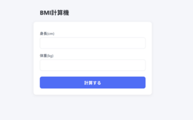
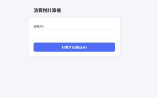
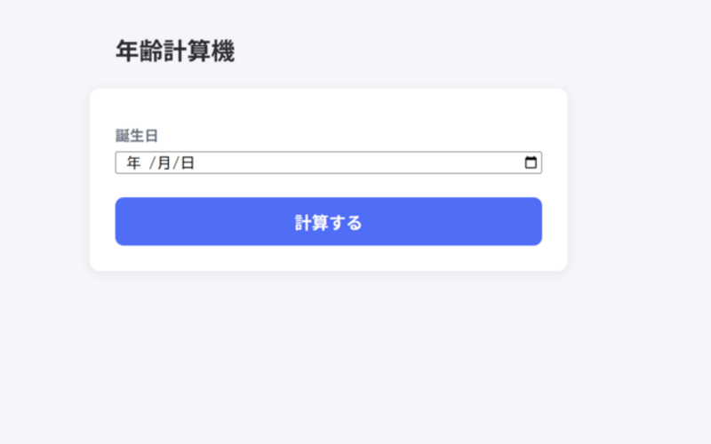
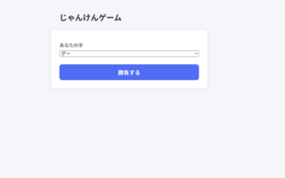
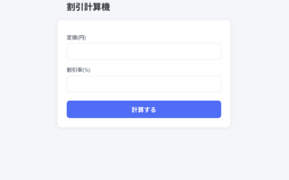
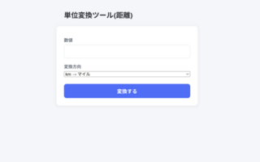

# PHP Practice

PHPの基礎を体に染み込ませるために作成した、小さな練習用アプリ集です。フォームの送信・受け取り、バリデーション、計算処理など、PHPの基本パターンを繰り返し練習することを目的にしています。

## アプリ一覧

| アプリ名         | ファイル     | 内容                                                       |
| ---------------- | ------------ | ---------------------------------------------------------- |
| BMI計算機        | bmi.php      | 身長・体重からBMIを計算                                    |
| 消費税計算機     | tax.php      | 金額から税込み価格を計算                                   |
| 割り勘計算機     | warikan.php  | 合計金額と人数から1人あたりの金額を計算(切り上げ)          |
| 年齢計算機       | age.php      | 生年月日から満年齢を計算(DateTimeクラス、未来日付チェック) |
| じゃんけんゲーム | janken.php   | ランダムなコンピュータの手と勝負(配列、ランダム処理)       |
| 割引計算機       | discount.php | 定価と割引率から割引後の価格を計算(範囲チェック)           |
| 単位変換ツール   | convert.php  | km⇔マイルの距離変換(switch文)                              |

## スクリーンショット

  

  



## 学んだこと

- `$_POST`, `$_GET`, `$_SERVER['REQUEST_METHOD']`によるフォーム処理の基本パターン
- `validate〇〇(string $value): string` という統一されたバリデーション関数の設計
- `htmlspecialchars()`によるXSS対策
- `DateTime`クラスによる日付の扱い
- 配列、`array_rand()`, `in_array()`
- `switch`文による分岐処理

## 環境構築

```bash
git clone https://github.com/kazuyuki-a-dev/php-practice.git
cd php-practice
php -S localhost:8000
```

`http://localhost:8000/bmi.php` のように、各ファイルに直接アクセスして動作確認できます。

## 作成者

作成者: [kazuyuki asari]
GitHub: https://github.com/kazuyuki-a-dev
